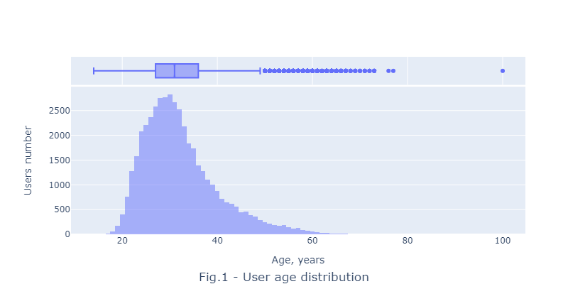

#  Job applicant salary prediction
---

## Content

[Summary](README.md#Summary)  
[Project description](README.md#Project-description)  
[Data](README.md#Data)                                
[Inferences](README.md#Inferences)                   
[Project file](https://github.com/Alex1iv/sf_data_sci/blob/main/2.%20Recruitment_platform_user_profiles_EDA/Project_en.ipynb) 

---

## Summary

It was created a machine learning model to predict job applicants salaries basing on their profiles. 

## Project description

HeadHunter.ru is a leading web recruitment platform in Russia and across former soviet countries. It stores multiple information about candidates and derives insights from it for offering best match for its clients (e.g. companies or enterpreneurs). 

Sometimes job applicants omit to enter a desired salary amount in order to expand it range. Nevertheless, the salary value is important for the platform to recommend relevant candidates to employers. So it was decided to create a model, predicting the applicant salary using the information which he actually did enter.

## Data and methods

From the original database with candidate profiles it was acquired a sample dataset with about 50.000 entries. Due to large size of the data base exceeding the GitHub' s filesize limit of 25 mb, it is stored and downloaded from the [Google Drive](https://drive.google.com/file/d/1LpReiJ8hQJHbGBiv1Vsp2WDYdO2qaRtA/view?usp=share_link). 

:arrow_up:[ to content](README.md#Content)

## Explorative data analysis

As it can be seen from the fig.1, the distribution schape is close to log-normal, positive or left-skew with peak around 30 years. The age set contains min=14 years and max= 100 years. The age of users majority is between 27 and 36 years.

  
 

### Inferences
- the database was successfully cleaned from duplicated inputs and missed values.
- original database contained features, which combining heterogeneous candidates information. Since the data structure is difficult to study, it was structurized in the cleaned database. Meanwhile, the number of features in the cleaned database has increased in 2.25 times by comparisson with that of the original database.

:arrow_up:[ to content](README.md#Content)

The assignment can be logically subdivided into 4 parts:
- structural analysis of the db;
- data structuring;
- exploratory data analysis;
- data cleaning from duplicated or missed values.

The result is presented in a [jupyter-notebook](https://github.com/Alex1iv/sf_data_sci/blob/main/2.%20Recruitment_platform_user_profiles_EDA/Project_en.ipynb).

:arrow_up:[ to content](README.md#Content)
